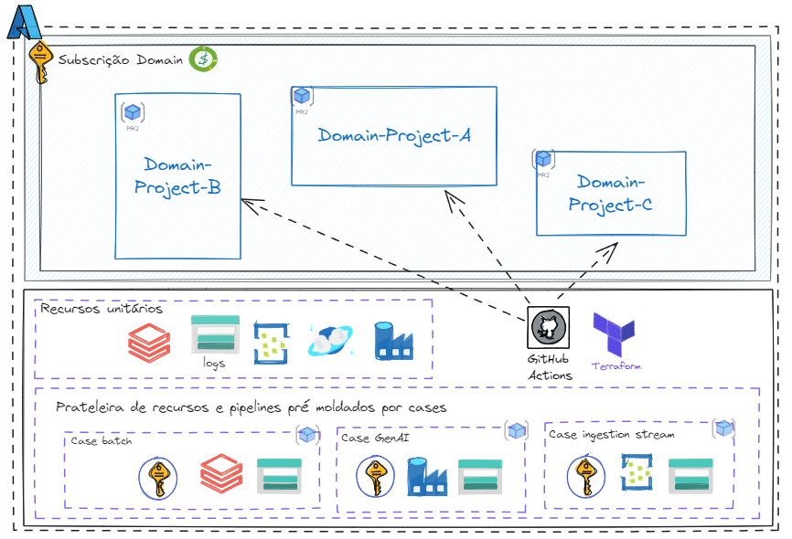
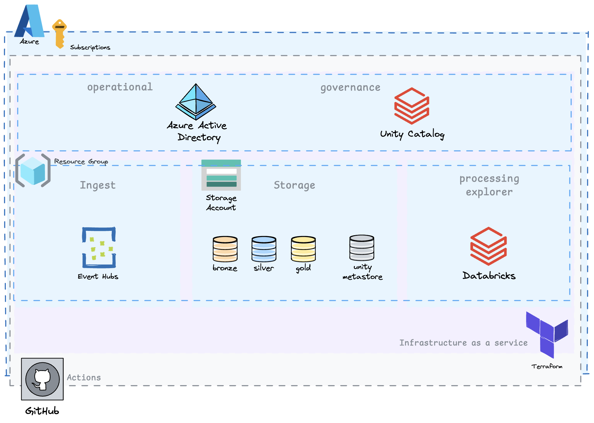
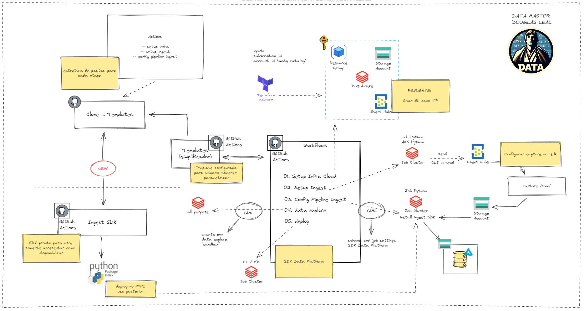
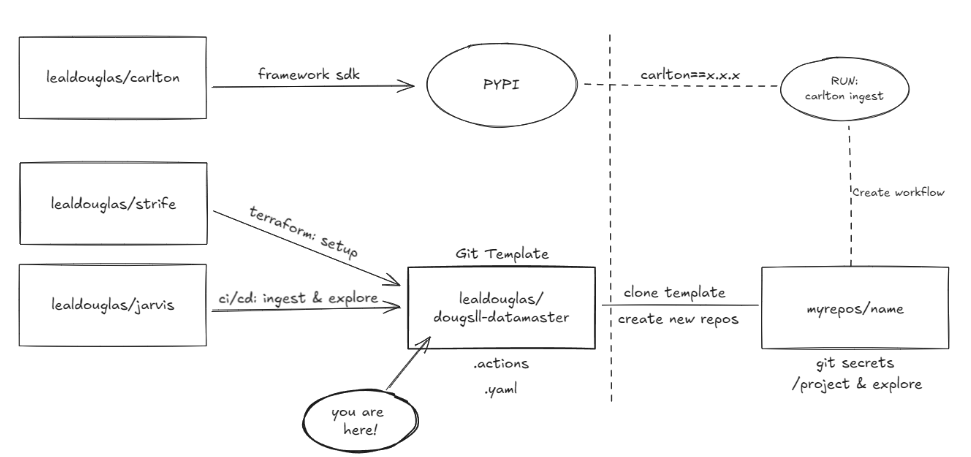

# Data Master Douglas Leal

{ width="250" .center }

O repositório [dougsll-datamaster](https://github.com/lealdouglas/dougsll-datamaster) é uma solução para o programa Data Master organizado pela F1rst Santander. Solução proposta e desenvolvida por [Douglas Leal](https://www.linkedin.com/in/douglasleall/). 

## 1. Objetivo do Case

Este projeto visa desenvolver uma solução de engenharia de dados com o principal objetivo de preparar um ambiente para estudo e exploração de dados baseado em nuvem em poucos minutos. O projeto simula a criação de um ambiente conceitual de dados para um domínio de dados, configurando o ambiente para realizar ações como pipelines de ingestão e exploração de dados.

## 2. Arquitetura de Solução

### 2.1 Visão Geral

A solução é projetada para preparar um ambiente de estudo e exploração de dados baseado em nuvem em poucos minutos. Considere o seguinte cenário: Eu, como engenheiro de dados e/ou ML, a partir de uma subscrição demoninada como "domínio de dados riscos (drisc)" preciso montar o setup do meu ambiente cloud e criar o pipeline de dados, desde a ingestão até a construção de uma smart table. Nesse cenário, preciso considerar a configuração de um ambiente governado, baseado em uma arquitetura medalhão, explorar dados e implantar um motor. A solução deve permitir ao desenvolvedor configurar seu ambiente, simulando uma prateleira de recursos para dados, e, com poucas configurações, definir um fluxo de ingestão e entregar um ambiente para exploração de dados, integrado à jornada de implantação. Toda a jornada apresentada em um só lugar, de maneira básica e bem feita.

{ width="750" .center }

### 2.2 Diagrama de Arquitetura de Solução

A solução utiliza Azure como provedora de nuvem, Active Directory para gestão de grupos e usuários, Event Hub para ingestão de dados (opcional), Databricks para processamento e análise, Unity Catalog para governança e gestão dos dados, e Azure Storage para armazenamento seguro. Outras tecnologias, como o setup via Terraform e o gerenciamento das automações via contrato de dados, que visam simplificar a relação dos serviços com a plataforma e dados, também estão incorporadas nessa solução.

{ width="750" .center }

### 2.3 Descrição dos Componentes

- **Event Hub (opcional)**: Captura dados de transações em tempo real de várias fontes, como sistemas de pagamento e bancos.
- **Azure Databricks**: Processa os dados capturados, executa algoritmos de detecção de fraudes e prepara os dados para armazenamento.
- **Azure Storage Account**: Armazena dados brutos e processados em camadas organizadas, conforme a arquitetura de medalhão (bronze, silver, gold).
- **Segurança**: Implementa políticas de mascaramento de dados e criptografia para proteger informações sensíveis.
- **Observabilidade**: Utiliza monitoramento contínuo para garantir o funcionamento correto do sistema, com alertas configurados para falhas e anomalias.

{ width="750" .center }

## 3. Arquitetura Técnica

### 3.1 Visão Geral

A arquitetura técnica é baseada em uma infraestrutura provisionada via Terraform, com pipelines automatizados usando GitHub Actions, processamento em tempo real no Azure Databricks, e armazenamento seguro de dados no Azure Storage Account.

### 3.2 Sobre o projeto

Todo projeto inicia com uma ideia...

{ width="750" .center }

...que precisa ser organizada.

### 3.3 Ideação do Projeto

Este projeto foi idealizado para que os usuários tenham um ambiente mínimo para explorar dados. Três repositórios foram criados para que, a partir desse git template, seja possível ter um ambiente ponta a ponta. A ideação está organizada da seguinte forma:

{ width="750" .center }

Ao Clonar repos template, o usuário deve setar as variaveis de ambiente necessário no git, configurar os arquivos .yaml e iniciar as execuções.
Na etapa de ingestão, o job executor fará download do pypi para uso do framework padrão da plataforma apresentada.

Repositório adicionais utilizados nesse projeto para experiência imersiva:

- [lealdouglas/strife](https://github.com/lealdouglas/strife), Setup de infraestrutura (recursos).
- [lealdouglas/jarvis](https://github.com/lealdouglas/jarvis), Delivery do pipeline de dados.
- [lealdouglas/carlton](https://github.com/lealdouglas/carlton), SDK comum padrão da plataforma de dados.
